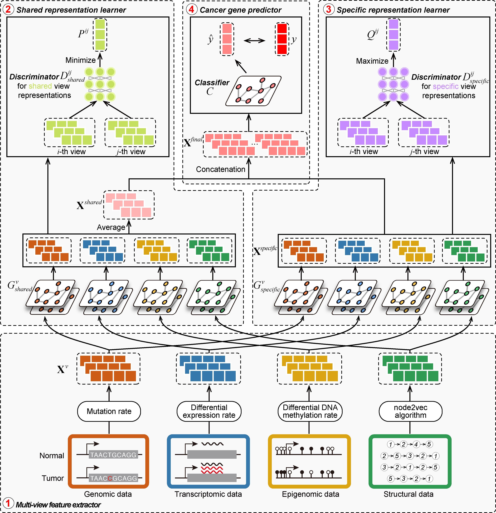

Cross-validation data

Cross-validation data

# IMVRL-GCN

An Interpretable Multi-View Representation Learning framework based on Graph Convolutional Network specifically designed for cancer gene prediction.



# Requirements

* python==3.7.0
* torch==1.13.1
* torch-geometric==2.3.1
* numpy==1.21.6

```
# Create a virtual environment and install the requirements
conda create -n [ENVIRONMENT NAME] python==3.7.0
conda activate [ENVIRONMENT NAME]
pip install -r requirements.txt
```

# Data descriptions

* `data/CPDB_datasets.pkl` - The PPI network and gene features for CPDB datasets
* `data/k_sets.pkl` - Cross-validation data

# Model training

Start model training

```
python CancerGenePrediction.py
```
